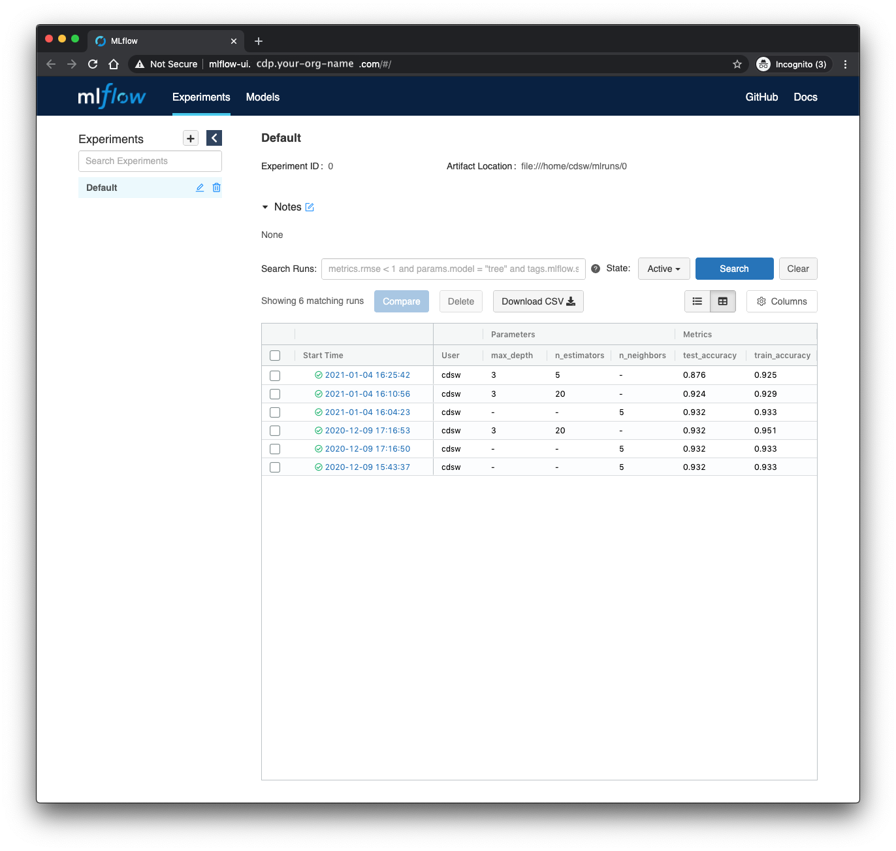

# MLFlow for experiment tracking

[MLFlow](https://www.mlflow.org/) self describes as

> an open source platform to manage the ML lifecycle, including experimentation, reproducibility, deployment, and a central model registry.

In particular MLFlow's experiment tracking capabilities offer a low-friction way of tracking model hyperparameters and metrics across many experiments.
This repository demonstrates the use of MLFlow tracking in a couple of simple machine learning model training scripts inside Cloudera Machine Learning (CML) and Cloudera Data Science Workbench (CDSW).
(We will refer only to CML in the remainder of this README, but the code should function equally well in either CML or CDSW).
This functions as less a tutorial on MLFlow, and more an example of running MLFlow inside CML.

The rest of this README is structured as follows.

1. **Repository structure**. A brief orientation to the structure of the repository.
2. **Running through the analysis**. How to run model training and testing, logging experimental results with MLFlow.
3. **Investigating the results**. Using the MLFlow UI to investigate the results.


## Structure

The folder structure of this repo is as follows

```
.
├── cml       # This folder contains scripts that facilitate the project launch on CML
└── scripts   # Our analysis code
```

When the training scripts have been run (this will happen on project launch if using the CML Applied ML Prototype interface), an additional `mlruns` directory will appear for use by MLFlow.
This can be redirected to another location (HDFS, for instance) 

### cml

These scripts are specific to Cloudera Machine Learning, and, with the `.project-metadata.yaml` file in the root directory, allow the project to be deployed automatically, following a declarative specification for jobs, model endpoints and applications.

```
cml
├── install_dependencies.py # Script to run pip install of Python dependencies
└── mlflow_ui.py            # Script to launch MLFlow ui application.
```

### scripts

This is where all our analysis code lives.
In a more involved analysis, we could replace these scripts with jupyter notebooks to run manually, or abstract some re-usable code into a Python libary.

```
scripts
├── data.py                 # create fake train and test data
├── train_kneighbors.py     # train a k-nearest neighbors classifier
└── train_random_forest.py  # train a random forest classifier
```

## Running through the analysis

If this repo is imported as an Applied Machine Learning Prototype in CML, the launch process should handle all the setup for you, and you can skip the Installation step.
In case you want to run through it manually, follow the instructions in the Installation section below.

### Installation

The code was developed for Python 3.6.9, and will likely work on more later versions.
To install dependencies, first create and activate a new virtual environment through your preferred means, then pip install from the requirements file. For instance:

```
python3 -m venv .venv
source .venv/bin/activate
pip install -r requirements.txt
```

If you are working in CML or CDSW, no virtual environment is necessary.
Instead, inside a Python 3 session, simply run

```
!pip3 install -r requirements.xt
```

### Scripts

Inside the `scripts/` directory are three scripts, as described above.
The `data.py` script creates a fake dataset for a supervised classification problem.
When working with genuine business data, we'd probably be reading this data from a database or flat file storage.

There are two training scripts.
`train_kneighbors.py` trains a k-nearest neighbors algorithm, where the number of neighbors to consider is provided as a command line argument.
`train_random_forest.py` trains a random forest, and we expose two hyperparameters&mdash;the maximum tree depth and number of trees&mdash;as command line arguments.
Each script is instrumented with MLFlow to log the hyperparameters used and the accuracy of the trained model on a train and test set.

To train the k-nearest neighbors model, start a CML session and run `!python3 train_kneighbors.py` in the session Python prompt, or without the bang (`!`) in the session terminal.
This will train the model with the default (5) nearest neighbors.
To run with a different number of neighbors, pass a command line argument like so:

```bash
!python3 train_kneighbors.py --n-neighbors 3
```

If the code was imported as an Applied Machine Learning Prototype, the declarative project will have run each training script once, with default hyperparameters.
Feel free to run the scripts some additional times, passing different hyperparameters.

## Viewing the MLFlow UI

Since our training scripts were instrumented with MLFlow, the parameters, metrics, models and additional metadata associated with any training runs will have been logged in the `mlruns` directory.
We can investigate the performance metrics for each run using MLFlow's UI.
The automated setup will have created a CML Application called "MLFlow UI" that can be visited from the Applications tab of CML, and will look something like this.



We can now interact with the MLFLow UI as if it were running on our local machine to compare model training runs.
